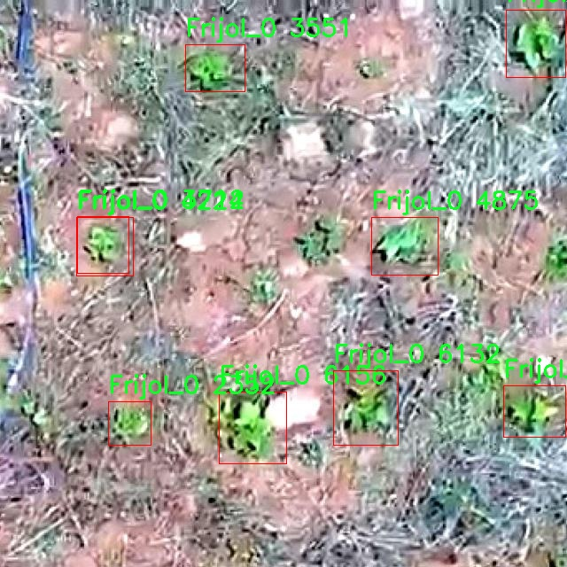

# 豆类苗叶检测检测系统源码分享
 # [一条龙教学YOLOV8标注好的数据集一键训练_70+全套改进创新点发刊_Web前端展示]

### 1.研究背景与意义

项目参考[AAAI Association for the Advancement of Artificial Intelligence](https://gitee.com/qunmasj/projects)

项目来源[AACV Association for the Advancement of Computer Vision](https://kdocs.cn/l/cszuIiCKVNis)

研究背景与意义

随着农业现代化的不断推进，智能化技术在农业生产中的应用日益广泛，尤其是在作物生长监测和病虫害防治等方面，图像识别技术的引入为农业管理提供了新的解决方案。豆类作物作为全球重要的粮食和经济作物，其生长状态的实时监测对于提高产量和质量具有重要意义。传统的人工检测方法不仅耗时耗力，而且容易受到主观因素的影响，难以保证检测的准确性和一致性。因此，基于计算机视觉的自动化检测系统应运而生，成为提升农业生产效率的重要工具。

在众多的图像识别算法中，YOLO（You Only Look Once）系列算法因其高效的实时检测能力而备受关注。YOLOv8作为该系列的最新版本，结合了深度学习和卷积神经网络的优势，能够在保证检测精度的同时实现快速处理，适合于农业领域的应用。然而，现有的YOLOv8模型在特定作物的苗叶检测中仍存在一定的局限性，尤其是在不同环境和光照条件下的适应性不足。因此，针对豆类苗叶的特征进行改进和优化，构建一个专门的检测系统，具有重要的研究价值和实际意义。

本研究将基于改进的YOLOv8模型，构建一个专门针对豆类苗叶的检测系统。我们使用的数据集包含3100张图像，涵盖了两类豆类作物，即“Daniel”和“Frijol_0”。这些图像的多样性和丰富性为模型的训练提供了良好的基础，能够有效提升模型的泛化能力。通过对数据集的深入分析和处理，我们将针对豆类苗叶的特征进行数据增强，提升模型在不同环境下的鲁棒性。此外，改进YOLOv8的网络结构和损失函数，将有助于提高模型在小目标检测和复杂背景下的表现，从而实现更高的检测精度。

本研究的意义不仅在于推动计算机视觉技术在农业领域的应用，更在于为豆类作物的生长监测提供一种高效、智能的解决方案。通过实现自动化的苗叶检测，农民可以更及时地获取作物生长状态的信息，从而优化管理决策，减少资源浪费，提高生产效率。此外，该系统的成功应用还将为其他作物的智能检测提供借鉴，推动农业智能化的进一步发展。

综上所述，基于改进YOLOv8的豆类苗叶检测系统的研究，不仅具有重要的理论价值，也具有广泛的应用前景。通过本研究，我们期望能够为农业生产提供更为精准和高效的技术支持，助力实现可持续农业的发展目标。

### 2.图片演示


##### 注意：由于此博客编辑较早，上面“2.图片演示”和“3.视频演示”展示的系统图片或者视频可能为老版本，新版本在老版本的基础上升级如下：（实际效果以升级的新版本为准）

  （1）适配了YOLOV8的“目标检测”模型和“实例分割”模型，通过加载相应的权重（.pt）文件即可自适应加载模型。

  （2）支持“图片识别”、“视频识别”、“摄像头实时识别”三种识别模式。

  （3）支持“图片识别”、“视频识别”、“摄像头实时识别”三种识别结果保存导出，解决手动导出（容易卡顿出现爆内存）存在的问题，识别完自动保存结果并导出到tempDir中。

  （4）支持Web前端系统中的标题、背景图等自定义修改，后面提供修改教程。

  另外本项目提供训练的数据集和训练教程,暂不提供权重文件（best.pt）,需要您按照教程进行训练后实现图片演示和Web前端界面演示的效果。

### 3.视频演示

[3.1 视频演示](https://www.bilibili.com/video/BV1H5s8eGEkX/)

### 4.数据集信息展示

##### 4.1 本项目数据集详细数据（类别数＆类别名）

nc: 2
names: ['Daniel', 'Frijol_0']


##### 4.2 本项目数据集信息介绍

数据集信息展示

在本研究中，我们使用的数据集名为“ProyectoF_0”，该数据集专门用于训练和改进YOLOv8模型，以实现高效的豆类苗叶检测系统。随着农业技术的不断进步，智能化的植物检测系统在作物管理和病虫害监测中扮演着越来越重要的角色。豆类作为一种重要的农作物，其苗叶的健康状况直接影响到作物的生长和产量。因此，构建一个准确且高效的检测系统对于提高农业生产效率具有重要意义。

“ProyectoF_0”数据集包含两类目标，分别为“Daniel”和“Frijol_0”。这两类名称不仅代表了不同的豆类苗叶类型，也反映了它们在生长过程中的不同特征和生理状态。通过对这两类的深入分析，我们能够更好地理解豆类苗叶的生长特性以及它们在不同环境条件下的表现。这种细致的分类将为YOLOv8模型的训练提供丰富的样本支持，使其能够在实际应用中实现更高的准确率和鲁棒性。

数据集的构建过程遵循了严格的标准，确保每一类样本的质量和多样性。样本的采集覆盖了不同生长阶段的豆类苗叶，确保模型能够学习到各种可能的特征变化。此外，数据集中还包含了不同光照、天气和土壤条件下的图像，这为模型的泛化能力提供了良好的基础。通过多样化的样本，YOLOv8能够在实际应用中应对各种复杂的环境因素，从而提升其在豆类苗叶检测中的表现。

在数据标注方面，我们采用了精确的标注工具，对每一张图像中的目标进行细致的框选和分类。这一过程不仅提高了数据集的准确性，也为后续的模型训练提供了可靠的标签信息。标注的准确性直接影响到模型的学习效果，因此我们在标注过程中严格把控，确保每一类目标都能被准确识别和分类。

在模型训练阶段，我们将“ProyectoF_0”数据集与YOLOv8模型相结合，进行多轮的训练和验证。通过不断调整模型参数和优化算法，我们期望能够显著提高豆类苗叶的检测精度。数据集的多样性和丰富性为模型提供了强大的学习基础，使其能够在面对不同的豆类苗叶时，依然保持高效的检测能力。

综上所述，“ProyectoF_0”数据集在豆类苗叶检测系统的开发中发挥了至关重要的作用。通过对数据集的深入分析和有效利用，我们不仅能够提升YOLOv8模型的性能，还能为农业智能化的发展贡献一份力量。未来，我们希望能够将这一检测系统推广到更广泛的农业应用中，帮助农民实现精准管理，提高作物产量和质量。





### 5.全套项目环境部署视频教程（零基础手把手教学）

[5.1 环境部署教程链接（零基础手把手教学）](https://www.ixigua.com/7404473917358506534?logTag=c807d0cbc21c0ef59de5)


[5.2 安装Python虚拟环境创建和依赖库安装视频教程链接（零基础手把手教学）](https://www.ixigua.com/7404474678003106304?logTag=1f1041108cd1f708b01a)

### 6.手把手YOLOV8训练视频教程（零基础小白有手就能学会）

[6.1 手把手YOLOV8训练视频教程（零基础小白有手就能学会）](https://www.ixigua.com/7404477157818401292?logTag=d31a2dfd1983c9668658)

### 7.70+种全套YOLOV8创新点代码加载调参视频教程（一键加载写好的改进模型的配置文件）

[7.1 70+种全套YOLOV8创新点代码加载调参视频教程（一键加载写好的改进模型的配置文件）](https://www.ixigua.com/7404478314661806627?logTag=29066f8288e3f4eea3a4)

### 8.70+种全套YOLOV8创新点原理讲解（非科班也可以轻松写刊发刊，V10版本正在科研待更新）

由于篇幅限制，每个创新点的具体原理讲解就不一一展开，具体见下列网址中的创新点对应子项目的技术原理博客网址【Blog】：


[8.1 70+种全套YOLOV8创新点原理讲解链接](https://gitee.com/qunmasj/good)

### 9.系统功能展示（检测对象为举例，实际内容以本项目数据集为准）

图9.1.系统支持检测结果表格显示

  图9.2.系统支持置信度和IOU阈值手动调节

  图9.3.系统支持自定义加载权重文件best.pt(需要你通过步骤5中训练获得)

  图9.4.系统支持摄像头实时识别

  图9.5.系统支持图片识别

  图9.6.系统支持视频识别

  图9.7.系统支持识别结果文件自动保存

  图9.8.系统支持Excel导出检测结果数据


### 10.原始YOLOV8算法原理

原始YOLOv8算法原理

YOLOv8算法是目标检测领域的一项重要进展，由Glenn-Jocher提出，继承了YOLO系列的优良传统，尤其是YOLOv3和YOLOv5的设计理念。YOLOv8在多个方面进行了创新和改进，旨在提升目标检测的准确性和效率。其核心原理围绕着数据预处理、网络结构设计、特征融合策略以及标签分配机制等方面展开，形成了一个高效的目标检测框架。

首先，在数据预处理方面，YOLOv8延续了YOLOv5的策略，采用了多种增强手段以提升模型的泛化能力。这些增强手段包括马赛克增强、混合增强、空间扰动和颜色扰动等。马赛克增强通过将多张图像拼接在一起，增加了训练样本的多样性，进而提高了模型对不同场景的适应能力。混合增强则通过将两张图像进行混合，进一步丰富了数据集的特征空间。空间扰动和颜色扰动则分别通过随机变换图像的空间布局和颜色特征，增加了模型对光照变化和物体位置变化的鲁棒性。这些预处理手段为YOLOv8提供了一个强大的数据基础，使其在训练过程中能够更好地学习到目标的特征。

在网络结构方面，YOLOv8的骨干网络设计延续了YOLOv5的思路，但进行了显著的改进。YOLOv8采用了新的C2f模块替代了YOLOv5中的C3模块。C2f模块通过引入更多的分支，增强了特征图的表达能力，并在梯度回传时提供了更丰富的支流。这种设计使得网络在学习过程中能够更有效地捕捉到多层次的特征信息，从而提升了检测的准确性。此外，YOLOv8仍然采用了特征金字塔网络（FPN）和路径聚合网络（PAN）的结构，以实现多尺度特征的融合。通过这种结构，YOLOv8能够有效地整合来自不同尺度的特征信息，增强了对小目标和大目标的检测能力。

在检测头的设计上，YOLOv8引入了“解耦头”的结构，显著改善了分类和定位任务的处理方式。与以往的耦合头不同，解耦头将分类和定位任务分为两个并行的分支，各自独立提取特征并进行处理。这种解耦设计使得模型在处理复杂场景时，能够更好地平衡分类和定位的性能，进而提高整体的检测精度。

标签分配策略是YOLOv8的一项重要创新。不同于YOLOv5依赖于候选框聚类的方式，YOLOv8采用了动态标签分配策略，使用TOOD方法来解决正负样本匹配的问题。这种策略不仅简化了标签分配的过程，还提高了模型对多尺度目标的适应能力。YOLOv8的损失函数设计也进行了优化，分类损失采用了变焦损失（VFL Loss），而回归损失则结合了CIoULoss和DFLLoss。这种损失函数的设计使得模型在训练过程中能够更有效地关注高质量的正样本，同时降低负样本对损失的影响，从而提升了模型的学习效率。

此外，YOLOv8还引入了无锚框的检测方式，直接预测目标的中心点和宽高比例。这一设计不仅减少了锚框的数量，还提高了检测速度和准确度。通过这种创新，YOLOv8能够在复杂场景中快速而准确地识别目标，满足实时检测的需求。

总的来说，YOLOv8算法在多个方面进行了深入的改进和创新，形成了一个高效、灵活的目标检测框架。通过优化数据预处理、网络结构、特征融合和标签分配策略，YOLOv8不仅继承了YOLO系列的优良传统，还在准确性和效率上实现了显著提升。这使得YOLOv8在目标检测领域具有广泛的应用前景，能够满足不同场景下的检测需求。随着YOLOv8的不断发展和完善，未来的目标检测技术将更加智能化和高效化，为各行各业的应用提供强有力的支持。


### 11.项目核心源码讲解（再也不用担心看不懂代码逻辑）

#### 11.1 ui.py

以下是对给定代码的核心部分进行保留和详细注释的版本：

```python
import sys
import subprocess

def run_script(script_path):
    """
    使用当前 Python 环境运行指定的脚本。

    Args:
        script_path (str): 要运行的脚本路径

    Returns:
        None
    """
    # 获取当前 Python 解释器的路径
    python_path = sys.executable

    # 构建运行命令，使用 streamlit 运行指定的脚本
    command = f'"{python_path}" -m streamlit run "{script_path}"'

    # 执行命令并等待其完成
    result = subprocess.run(command, shell=True)
    
    # 检查命令执行的返回码，如果不为0则表示出错
    if result.returncode != 0:
        print("脚本运行出错。")

# 实例化并运行应用
if __name__ == "__main__":
    # 指定要运行的脚本路径
    script_path = "web.py"  # 假设脚本在当前目录下

    # 调用函数运行指定的脚本
    run_script(script_path)
```

### 代码分析与注释

1. **导入模块**：
   - `import sys`: 导入 `sys` 模块以获取 Python 解释器的路径。
   - `import subprocess`: 导入 `subprocess` 模块以便在 Python 中执行外部命令。

2. **定义 `run_script` 函数**：
   - 该函数接受一个参数 `script_path`，表示要运行的 Python 脚本的路径。
   - 使用 `sys.executable` 获取当前 Python 解释器的路径。
   - 构建一个命令字符串，使用 `streamlit` 模块运行指定的脚本。
   - 使用 `subprocess.run` 执行构建的命令，并等待其完成。
   - 检查命令的返回码，如果返回码不为0，表示脚本运行出错，打印错误信息。

3. **主程序块**：
   - 使用 `if __name__ == "__main__":` 确保只有在直接运行该脚本时才会执行以下代码。
   - 指定要运行的脚本路径为 `web.py`（假设该脚本在当前目录下）。
   - 调用 `run_script` 函数来运行指定的脚本。

### 总结
该代码的核心功能是通过当前 Python 环境运行一个指定的 `streamlit` 脚本，并在运行过程中检查是否发生错误。

这个文件名为 `ui.py`，它的主要功能是运行一个指定的 Python 脚本，具体来说是使用 Streamlit 框架来启动一个 Web 应用。文件中首先导入了一些必要的模块，包括 `sys`、`os` 和 `subprocess`，以及一个自定义的函数 `abs_path`，这个函数可能用于获取文件的绝对路径。

在 `run_script` 函数中，首先获取当前 Python 解释器的路径，这样可以确保使用正确的 Python 环境来运行脚本。接着，构建一个命令字符串，这个命令会调用 Streamlit 来运行指定的脚本。命令的格式是 `python -m streamlit run "script_path"`，其中 `script_path` 是传入的参数。

然后，使用 `subprocess.run` 方法来执行这个命令。这个方法会在新的 shell 中运行命令，并等待其完成。如果命令执行后返回的状态码不为零，表示脚本运行出错，程序会打印出相应的错误信息。

在文件的最后部分，使用 `if __name__ == "__main__":` 语句来确保只有在直接运行该文件时才会执行后面的代码。在这里，指定了要运行的脚本路径为 `web.py`，并调用 `run_script` 函数来启动这个脚本。

总的来说，这个文件的作用是作为一个启动器，用于运行一个名为 `web.py` 的 Streamlit 应用，确保在正确的 Python 环境中执行，并处理可能出现的错误。

#### 11.2 70+种YOLOv8算法改进源码大全和调试加载训练教程（非必要）\ultralytics\hub\utils.py

以下是代码中最核心的部分，并附上详细的中文注释：

```python
import requests
from ultralytics.utils import TQDM, TryExcept, __version__, ENVIRONMENT, SETTINGS, RANK, ONLINE

def requests_with_progress(method, url, **kwargs):
    """
    使用指定的方法和URL进行HTTP请求，并可选地显示进度条。

    参数:
        method (str): 要使用的HTTP方法（例如 'GET', 'POST'）。
        url (str): 要发送请求的URL。
        **kwargs (dict): 传递给底层 `requests.request` 函数的其他关键字参数。

    返回:
        (requests.Response): HTTP请求的响应对象。
    """
    progress = kwargs.pop('progress', False)  # 从kwargs中获取进度条标志
    if not progress:
        return requests.request(method, url, **kwargs)  # 如果不需要进度条，直接发送请求

    # 如果需要进度条，使用流式请求
    response = requests.request(method, url, stream=True, **kwargs)
    total = int(response.headers.get('content-length', 0) if isinstance(progress, bool) else progress)  # 获取总大小
    try:
        pbar = TQDM(total=total, unit='B', unit_scale=True, unit_divisor=1024)  # 初始化进度条
        for data in response.iter_content(chunk_size=1024):  # 分块读取响应内容
            pbar.update(len(data))  # 更新进度条
        pbar.close()  # 关闭进度条
    except requests.exceptions.ChunkedEncodingError:  # 处理连接中断的异常
        response.close()  # 关闭响应
    return response  # 返回响应对象

def smart_request(method, url, retry=3, timeout=30, thread=True, verbose=True, progress=False, **kwargs):
    """
    使用'requests'库进行HTTP请求，支持指数退避重试机制。

    参数:
        method (str): 请求使用的HTTP方法。
        url (str): 要请求的URL。
        retry (int, optional): 放弃之前的重试次数，默认为3。
        timeout (int, optional): 超时时间（秒），默认为30。
        thread (bool, optional): 是否在单独的线程中执行请求，默认为True。
        verbose (bool, optional): 是否在控制台打印信息，默认为True。
        progress (bool, optional): 是否在请求期间显示进度条，默认为False。
        **kwargs (dict): 传递给请求函数的关键字参数。

    返回:
        (requests.Response): HTTP响应对象。
    """
    retry_codes = (408, 500)  # 仅对这些状态码进行重试

    @TryExcept(verbose=verbose)  # 使用TryExcept装饰器处理异常
    def func(func_method, func_url, **func_kwargs):
        """执行带有重试和超时的HTTP请求，并可选地跟踪进度。"""
        r = None  # 响应对象
        t0 = time.time()  # 记录开始时间
        for i in range(retry + 1):
            if (time.time() - t0) > timeout:  # 检查是否超时
                break
            r = requests_with_progress(func_method, func_url, **func_kwargs)  # 发送请求
            if r.status_code < 300:  # 如果状态码在2xx范围内，表示成功
                break
            # 处理失败的请求
            if i == 0:  # 仅在第一次失败时打印信息
                if r.status_code in retry_codes:
                    msg = f'Retrying {retry}x for {timeout}s.' if retry else ''
                    if verbose:
                        print(f'Warning: {msg} (Status Code: {r.status_code})')
                elif r.status_code == 429:  # 处理速率限制
                    h = r.headers
                    msg = f"Rate limit reached ({h['X-RateLimit-Remaining']}/{h['X-RateLimit-Limit']}). " \
                          f"Please retry after {h['Retry-After']}s."
                    if verbose:
                        print(f'Warning: {msg} (Status Code: {r.status_code})')
            time.sleep(2 ** i)  # 指数退避
        return r  # 返回响应对象

    args = method, url
    kwargs['progress'] = progress  # 将进度条标志传递给kwargs
    if thread:
        threading.Thread(target=func, args=args, kwargs=kwargs, daemon=True).start()  # 在新线程中执行请求
    else:
        return func(*args, **kwargs)  # 直接执行请求
```

### 代码核心部分说明：
1. **requests_with_progress**: 这个函数用于发送HTTP请求，并在下载过程中显示进度条。它支持流式下载，适合处理大文件的下载。
2. **smart_request**: 这个函数封装了HTTP请求的逻辑，支持重试机制和超时控制。它可以在后台线程中执行请求，适合需要长时间等待的操作。

这两个函数是进行网络请求的核心，能够处理请求的发送、进度的显示以及错误的重试。

这个程序文件是Ultralytics YOLO（You Only Look Once）项目的一部分，主要用于处理与Ultralytics HUB相关的实用工具。代码中包含了多个功能模块，主要涉及HTTP请求、事件收集和环境检测等。

首先，文件导入了一些必要的库，包括操作系统、平台、随机数、线程、时间和路径处理等。它还引入了Ultralytics项目中的一些工具函数和常量，如环境变量、日志记录、版本信息等。

接下来，定义了几个主要的函数。`request_with_credentials`函数用于在Google Colab环境中进行带有凭证的AJAX请求。该函数确保在Colab环境中运行，并通过JavaScript进行请求，返回响应数据。

`requests_with_progress`函数用于执行HTTP请求，并可选择性地显示下载进度条。它处理了响应的内容长度，并在下载过程中更新进度条。

`smart_request`函数则是一个更为复杂的HTTP请求处理函数，支持重试机制和超时设置。它可以在请求失败时自动重试，并在达到最大重试次数或超时后停止。该函数还可以在后台线程中运行，适合需要异步处理的场景。

接下来定义了一个`Events`类，用于收集匿名事件分析。该类的构造函数初始化了一些事件相关的属性，包括事件列表、速率限制、元数据等。事件收集功能在特定条件下启用，比如设置中允许同步、当前运行的环境等。`__call__`方法用于添加新事件并在达到速率限制时发送事件数据。

最后，文件在末尾创建了一个`Events`类的实例，准备在后续的代码中使用事件收集功能。

整体来看，这个文件的主要目的是提供与Ultralytics HUB交互的工具，支持HTTP请求、事件记录和环境检测等功能，为YOLOv8算法的改进和调试提供便利。

#### 11.3 code\ultralytics\models\yolo\pose\predict.py

以下是经过简化和注释的核心代码部分：

```python
# 导入必要的模块和类
from ultralytics.engine.results import Results
from ultralytics.models.yolo.detect.predict import DetectionPredictor
from ultralytics.utils import DEFAULT_CFG, LOGGER, ops

class PosePredictor(DetectionPredictor):
    """
    PosePredictor类，继承自DetectionPredictor，用于基于姿态模型的预测。
    """

    def __init__(self, cfg=DEFAULT_CFG, overrides=None, _callbacks=None):
        """初始化PosePredictor，设置任务为'pose'并记录使用'mps'作为设备的警告。"""
        super().__init__(cfg, overrides, _callbacks)  # 调用父类构造函数
        self.args.task = "pose"  # 设置任务为姿态预测
        # 检查设备是否为MPS，并记录警告
        if isinstance(self.args.device, str) and self.args.device.lower() == "mps":
            LOGGER.warning(
                "WARNING ⚠️ Apple MPS known Pose bug. Recommend 'device=cpu' for Pose models. "
                "See https://github.com/ultralytics/ultralytics/issues/4031."
            )

    def postprocess(self, preds, img, orig_imgs):
        """处理预测结果，返回给定输入图像或图像列表的检测结果。"""
        # 应用非极大值抑制（NMS）以过滤预测框
        preds = ops.non_max_suppression(
            preds,
            self.args.conf,  # 置信度阈值
            self.args.iou,  # IOU阈值
            agnostic=self.args.agnostic_nms,  # 是否类别无关的NMS
            max_det=self.args.max_det,  # 最大检测框数量
            classes=self.args.classes,  # 过滤的类别
            nc=len(self.model.names),  # 类别数量
        )

        # 如果输入图像不是列表，则将其转换为numpy数组
        if not isinstance(orig_imgs, list):
            orig_imgs = ops.convert_torch2numpy_batch(orig_imgs)

        results = []  # 存储结果的列表
        for i, pred in enumerate(preds):
            orig_img = orig_imgs[i]  # 获取原始图像
            # 调整预测框的坐标到原始图像的大小
            pred[:, :4] = ops.scale_boxes(img.shape[2:], pred[:, :4], orig_img.shape).round()
            # 获取关键点预测并调整其坐标
            pred_kpts = pred[:, 6:].view(len(pred), *self.model.kpt_shape) if len(pred) else pred[:, 6:]
            pred_kpts = ops.scale_coords(img.shape[2:], pred_kpts, orig_img.shape)
            img_path = self.batch[0][i]  # 获取图像路径
            # 将结果添加到结果列表中
            results.append(
                Results(orig_img, path=img_path, names=self.model.names, boxes=pred[:, :6], keypoints=pred_kpts)
            )
        return results  # 返回处理后的结果
```

### 代码注释说明：
1. **导入模块**：导入所需的类和函数，主要用于结果处理和模型预测。
2. **PosePredictor类**：继承自`DetectionPredictor`，用于实现姿态预测功能。
3. **构造函数**：初始化类的实例，设置任务类型为姿态预测，并处理设备类型的警告。
4. **postprocess方法**：处理模型的预测结果，进行非极大值抑制，调整预测框和关键点的坐标，并返回最终的结果列表。

这个程序文件是一个用于姿态预测的类，名为 `PosePredictor`，它继承自 `DetectionPredictor` 类。该类的主要功能是基于姿态模型进行预测，适用于使用 YOLO（You Only Look Once）模型进行目标检测和姿态估计的场景。

在文件开头，导入了一些必要的模块和类，包括 `Results`、`DetectionPredictor` 和一些工具函数。`Results` 类用于存储预测结果，`DetectionPredictor` 是基础的检测预测类，而 `ops` 则包含了一些操作函数。

`PosePredictor` 类的构造函数 `__init__` 初始化了预测器，并将任务类型设置为 "pose"。如果设备被设置为 "mps"（Apple 的 Metal Performance Shaders），则会发出警告，提示用户在使用姿态模型时建议使用 "cpu" 设备，因为在 MPS 上存在已知的 bug。

`postprocess` 方法用于处理预测结果。它接收预测结果、输入图像和原始图像作为参数。首先，使用非极大值抑制（NMS）对预测结果进行筛选，以消除重叠的检测框。接着，如果输入的原始图像不是列表形式，则将其转换为 NumPy 数组。

随后，程序遍历每个预测结果，并根据原始图像的尺寸调整检测框和关键点的坐标。具体来说，`scale_boxes` 和 `scale_coords` 函数用于将预测的框和关键点坐标从输入图像的尺寸缩放到原始图像的尺寸。最后，将处理后的结果存储在 `Results` 对象中，并将其添加到结果列表中。

整个类的设计旨在提供一个方便的接口，用户可以通过简单的调用来进行姿态预测，并获取处理后的结果。这使得使用 YOLO 模型进行姿态估计变得更加高效和易于使用。

#### 11.4 70+种YOLOv8算法改进源码大全和调试加载训练教程（非必要）\ultralytics\nn\backbone\VanillaNet.py

以下是经过简化并添加详细中文注释的核心代码部分：

```python
import torch
import torch.nn as nn
import torch.nn.functional as F
from timm.layers import weight_init

# 定义激活函数类
class Activation(nn.ReLU):
    def __init__(self, dim, act_num=3, deploy=False):
        super(Activation, self).__init__()
        self.deploy = deploy  # 是否为部署模式
        # 权重参数，形状为 (dim, 1, act_num*2 + 1, act_num*2 + 1)
        self.weight = torch.nn.Parameter(torch.randn(dim, 1, act_num*2 + 1, act_num*2 + 1))
        self.bias = None  # 偏置初始化为 None
        self.bn = nn.BatchNorm2d(dim, eps=1e-6)  # 批归一化层
        self.dim = dim
        self.act_num = act_num
        weight_init.trunc_normal_(self.weight, std=.02)  # 权重初始化

    def forward(self, x):
        # 前向传播
        if self.deploy:
            # 在部署模式下，直接进行卷积
            return F.conv2d(
                super(Activation, self).forward(x), 
                self.weight, self.bias, padding=(self.act_num*2 + 1)//2, groups=self.dim)
        else:
            # 否则，先进行批归一化再卷积
            return self.bn(F.conv2d(
                super(Activation, self).forward(x),
                self.weight, padding=self.act_num, groups=self.dim))

    def switch_to_deploy(self):
        # 切换到部署模式
        if not self.deploy:
            kernel, bias = self._fuse_bn_tensor(self.weight, self.bn)  # 融合批归一化
            self.weight.data = kernel
            self.bias = torch.nn.Parameter(torch.zeros(self.dim))
            self.bias.data = bias
            self.__delattr__('bn')  # 删除 bn 属性
            self.deploy = True

    def _fuse_bn_tensor(self, weight, bn):
        # 融合卷积层和批归一化层的权重和偏置
        kernel = weight
        running_mean = bn.running_mean
        running_var = bn.running_var
        gamma = bn.weight
        beta = bn.bias
        eps = bn.eps
        std = (running_var + eps).sqrt()  # 计算标准差
        t = (gamma / std).reshape(-1, 1, 1, 1)  # 计算缩放因子
        return kernel * t, beta + (0 - running_mean) * gamma / std  # 返回融合后的权重和偏置

# 定义网络块
class Block(nn.Module):
    def __init__(self, dim, dim_out, act_num=3, stride=2, deploy=False):
        super().__init__()
        self.deploy = deploy
        if self.deploy:
            # 在部署模式下，使用简单的卷积
            self.conv = nn.Conv2d(dim, dim_out, kernel_size=1)
        else:
            # 否则，使用卷积和批归一化的组合
            self.conv1 = nn.Sequential(
                nn.Conv2d(dim, dim, kernel_size=1),
                nn.BatchNorm2d(dim, eps=1e-6),
            )
            self.conv2 = nn.Sequential(
                nn.Conv2d(dim, dim_out, kernel_size=1),
                nn.BatchNorm2d(dim_out, eps=1e-6)
            )

        # 池化层的选择
        self.pool = nn.Identity() if stride == 1 else nn.MaxPool2d(stride)
        self.act = Activation(dim_out, act_num)  # 激活函数

    def forward(self, x):
        # 前向传播
        if self.deploy:
            x = self.conv(x)
        else:
            x = self.conv1(x)
            x = F.leaky_relu(x, 1)  # 使用 Leaky ReLU 激活
            x = self.conv2(x)

        x = self.pool(x)  # 池化
        x = self.act(x)  # 激活
        return x

# 定义 VanillaNet 网络
class VanillaNet(nn.Module):
    def __init__(self, in_chans=3, num_classes=1000, dims=[96, 192, 384, 768], 
                 drop_rate=0, act_num=3, strides=[2,2,2,1], deploy=False):
        super().__init__()
        self.deploy = deploy
        if self.deploy:
            # 在部署模式下，构建网络的初始部分
            self.stem = nn.Sequential(
                nn.Conv2d(in_chans, dims[0], kernel_size=4, stride=4),
                Activation(dims[0], act_num)
            )
        else:
            # 否则，使用卷积和批归一化的组合
            self.stem1 = nn.Sequential(
                nn.Conv2d(in_chans, dims[0], kernel_size=4, stride=4),
                nn.BatchNorm2d(dims[0], eps=1e-6),
            )
            self.stem2 = nn.Sequential(
                nn.Conv2d(dims[0], dims[0], kernel_size=1, stride=1),
                nn.BatchNorm2d(dims[0], eps=1e-6),
                Activation(dims[0], act_num)
            )

        self.stages = nn.ModuleList()  # 存储网络的各个阶段
        for i in range(len(strides)):
            stage = Block(dim=dims[i], dim_out=dims[i+1], act_num=act_num, stride=strides[i], deploy=deploy)
            self.stages.append(stage)  # 添加网络块

    def forward(self, x):
        # 前向传播
        if self.deploy:
            x = self.stem(x)
        else:
            x = self.stem1(x)
            x = F.leaky_relu(x, 1)  # 使用 Leaky ReLU 激活
            x = self.stem2(x)

        for stage in self.stages:
            x = stage(x)  # 通过每个阶段
        return x

    def switch_to_deploy(self):
        # 切换到部署模式
        if not self.deploy:
            # 融合 stem1 和 stem2 的权重
            kernel, bias = self._fuse_bn_tensor(self.stem1[0], self.stem1[1])
            self.stem1[0].weight.data = kernel
            self.stem1[0].bias.data = bias
            self.stem = nn.Sequential(self.stem1[0], self.stem2[2])  # 更新 stem
            for stage in self.stages:
                stage.switch_to_deploy()  # 更新每个阶段
            self.deploy = True

# 测试模型
if __name__ == '__main__':
    inputs = torch.randn((1, 3, 640, 640))  # 输入数据
    model = VanillaNet()  # 创建模型
    pred = model(inputs)  # 进行预测
    for i in pred:
        print(i.size())  # 输出每层的尺寸
```

### 代码说明：
1. **Activation 类**：定义了一个自定义的激活函数类，包含了卷积和批归一化的融合方法。
2. **Block 类**：表示网络中的一个基本块，包含卷积、池化和激活函数的组合。
3. **VanillaNet 类**：定义了整个网络结构，包括输入层、多个块和前向传播方法。
4. **switch_to_deploy 方法**：用于将模型切换到部署模式，融合批归一化的权重。
5. **主函数**：创建模型并进行简单的前向传播测试，输出每层的输出尺寸。

这个程序文件是一个实现了VanillaNet网络结构的PyTorch代码，属于YOLOv8算法改进的源码之一。代码中包含了多个类和函数，用于构建和训练VanillaNet模型。

首先，文件中引入了必要的库，包括PyTorch的核心库和一些功能模块，如卷积层、批归一化、激活函数等。接着，定义了一个名为`activation`的类，继承自`nn.ReLU`，该类实现了一个可学习的激活函数。它的构造函数中定义了权重和偏置，并使用批归一化来处理输入。`forward`方法中根据是否处于部署模式，选择不同的计算方式。

接下来，定义了一个`Block`类，表示网络中的一个基本模块。这个模块包含了两个卷积层和一个激活函数，可能还会有池化层。根据输入的参数，可以选择不同的卷积和池化策略。`forward`方法实现了模块的前向传播，处理输入数据并返回输出。

然后，定义了`VanillaNet`类，这是整个网络的主类。它的构造函数中初始化了网络的结构，包括输入通道、类别数、各层的维度、丢弃率等。根据输入的参数，构建了多个`Block`模块并将其添加到一个模块列表中。`forward`方法中实现了网络的前向传播逻辑，处理输入并提取特征。

此外，代码中还包含了一些辅助函数，例如`update_weight`用于更新模型的权重，`vanillanet_x`系列函数用于创建不同配置的VanillaNet模型，并支持加载预训练权重。

最后，代码的主入口部分创建了一个随机输入，并实例化了一个VanillaNet模型，进行前向传播并打印输出特征的尺寸。这部分代码可以用于测试模型的构建是否正确。

总体而言，这个文件实现了一个灵活的网络结构，支持多种配置和预训练权重的加载，适用于图像处理和计算机视觉任务。

#### 11.5 train.py

以下是经过简化和注释的核心代码部分，主要保留了模型训练的核心逻辑和数据处理的关键函数：

```python
import random
import numpy as np
import torch.nn as nn
from ultralytics.data import build_dataloader, build_yolo_dataset
from ultralytics.engine.trainer import BaseTrainer
from ultralytics.models import yolo
from ultralytics.nn.tasks import DetectionModel
from ultralytics.utils import LOGGER, RANK
from ultralytics.utils.torch_utils import de_parallel, torch_distributed_zero_first

class DetectionTrainer(BaseTrainer):
    """
    扩展自 BaseTrainer 类，用于基于检测模型的训练。
    """

    def build_dataset(self, img_path, mode="train", batch=None):
        """
        构建 YOLO 数据集。

        参数:
            img_path (str): 包含图像的文件夹路径。
            mode (str): 模式，`train` 或 `val`，用户可以为每种模式自定义不同的增强。
            batch (int, optional): 批次大小，仅用于 `rect` 模式。默认为 None。
        """
        gs = max(int(de_parallel(self.model).stride.max() if self.model else 0), 32)
        return build_yolo_dataset(self.args, img_path, batch, self.data, mode=mode, rect=mode == "val", stride=gs)

    def get_dataloader(self, dataset_path, batch_size=16, rank=0, mode="train"):
        """构造并返回数据加载器。"""
        assert mode in ["train", "val"]
        with torch_distributed_zero_first(rank):  # 在 DDP 模式下，仅初始化一次数据集 *.cache
            dataset = self.build_dataset(dataset_path, mode, batch_size)
        shuffle = mode == "train"  # 训练模式下打乱数据
        workers = self.args.workers if mode == "train" else self.args.workers * 2
        return build_dataloader(dataset, batch_size, workers, shuffle, rank)  # 返回数据加载器

    def preprocess_batch(self, batch):
        """对图像批次进行预处理，包括缩放和转换为浮点数。"""
        batch["img"] = batch["img"].to(self.device, non_blocking=True).float() / 255  # 将图像转换为浮点数并归一化
        if self.args.multi_scale:  # 如果启用多尺度训练
            imgs = batch["img"]
            sz = (
                random.randrange(self.args.imgsz * 0.5, self.args.imgsz * 1.5 + self.stride)
                // self.stride
                * self.stride
            )  # 随机选择新的尺寸
            sf = sz / max(imgs.shape[2:])  # 计算缩放因子
            if sf != 1:
                ns = [
                    math.ceil(x * sf / self.stride) * self.stride for x in imgs.shape[2:]
                ]  # 计算新的形状
                imgs = nn.functional.interpolate(imgs, size=ns, mode="bilinear", align_corners=False)  # 进行插值缩放
            batch["img"] = imgs
        return batch

    def get_model(self, cfg=None, weights=None, verbose=True):
        """返回 YOLO 检测模型。"""
        model = DetectionModel(cfg, nc=self.data["nc"], verbose=verbose and RANK == -1)
        if weights:
            model.load(weights)  # 加载权重
        return model

    def plot_training_samples(self, batch, ni):
        """绘制带有注释的训练样本。"""
        plot_images(
            images=batch["img"],
            batch_idx=batch["batch_idx"],
            cls=batch["cls"].squeeze(-1),
            bboxes=batch["bboxes"],
            paths=batch["im_file"],
            fname=self.save_dir / f"train_batch{ni}.jpg",
            on_plot=self.on_plot,
        )
```

### 代码说明：
1. **`DetectionTrainer` 类**：继承自 `BaseTrainer`，用于实现 YOLO 模型的训练。
2. **`build_dataset` 方法**：根据输入的图像路径和模式（训练或验证）构建数据集。
3. **`get_dataloader` 方法**：创建数据加载器，支持分布式训练，并根据模式设置是否打乱数据。
4. **`preprocess_batch` 方法**：对输入的图像批次进行预处理，包括归一化和多尺度调整。
5. **`get_model` 方法**：返回一个 YOLO 检测模型实例，并可选择加载预训练权重。
6. **`plot_training_samples` 方法**：绘制训练样本及其对应的标签和边界框，便于可视化训练过程。

这个程序文件 `train.py` 是一个用于训练 YOLO（You Only Look Once）目标检测模型的脚本，继承自 `BaseTrainer` 类。该文件主要包含了训练过程中需要的各种功能和方法。

首先，程序导入了一些必要的库和模块，包括数学运算、随机数生成、深度学习相关的库（如 PyTorch），以及 YOLO 模型和数据处理的相关工具。通过这些导入，程序能够构建数据集、创建数据加载器、定义模型等。

在 `DetectionTrainer` 类中，定义了多个方法来处理数据集的构建、数据加载、图像预处理、模型属性设置等。`build_dataset` 方法用于构建 YOLO 数据集，接受图像路径、模式（训练或验证）和批次大小作为参数。它通过调用 `build_yolo_dataset` 函数来生成数据集。

`get_dataloader` 方法则用于构建数据加载器，确保在分布式训练时只初始化一次数据集，并根据模式选择是否打乱数据。它还根据训练或验证模式设置工作线程的数量。

在 `preprocess_batch` 方法中，程序对图像批次进行预处理，包括将图像缩放到合适的大小并转换为浮点数格式。这个方法还支持多尺度训练，通过随机选择图像大小来增强模型的鲁棒性。

`set_model_attributes` 方法用于设置模型的属性，包括类别数量和类别名称等，以确保模型能够正确处理数据集中的目标。

`get_model` 方法用于返回一个 YOLO 检测模型，支持加载预训练权重。`get_validator` 方法则返回一个用于模型验证的 `DetectionValidator` 实例，负责在验证阶段计算损失等指标。

`label_loss_items` 方法用于返回带有标签的训练损失项的字典，便于监控训练过程中的损失变化。`progress_string` 方法则返回一个格式化的字符串，显示训练进度，包括当前的 epoch、GPU 内存使用情况、损失值、实例数量和图像大小等信息。

此外，程序还提供了 `plot_training_samples` 和 `plot_training_labels` 方法，用于可视化训练样本及其标注，帮助用户直观地了解训练数据的情况。`plot_metrics` 方法则用于从 CSV 文件中绘制训练过程中的指标，生成可视化结果。

总体而言，这个 `train.py` 文件为 YOLO 模型的训练提供了全面的支持，涵盖了数据处理、模型构建、训练监控和结果可视化等多个方面。

#### 11.6 code\ultralytics\models\sam\modules\tiny_encoder.py

以下是经过简化并添加详细中文注释的核心代码部分：

```python
import torch
import torch.nn as nn
import torch.nn.functional as F

class Conv2d_BN(torch.nn.Sequential):
    """执行2D卷积操作并随后进行批量归一化的序列容器。"""

    def __init__(self, in_channels, out_channels, kernel_size=1, stride=1, padding=0):
        """初始化卷积层和批量归一化层。"""
        super().__init__()
        # 添加卷积层
        self.add_module("conv", torch.nn.Conv2d(in_channels, out_channels, kernel_size, stride, padding, bias=False))
        # 添加批量归一化层
        self.add_module("bn", torch.nn.BatchNorm2d(out_channels))


class PatchEmbed(nn.Module):
    """将图像嵌入为补丁并投影到指定的嵌入维度。"""

    def __init__(self, in_chans, embed_dim, resolution, activation):
        """初始化补丁嵌入层。"""
        super().__init__()
        img_size = (resolution, resolution)  # 假设输入为正方形图像
        self.patches_resolution = (img_size[0] // 4, img_size[1] // 4)  # 计算补丁分辨率
        self.seq = nn.Sequential(
            Conv2d_BN(in_chans, embed_dim // 2, kernel_size=3, stride=2, padding=1),
            activation(),
            Conv2d_BN(embed_dim // 2, embed_dim, kernel_size=3, stride=2, padding=1),
        )

    def forward(self, x):
        """通过补丁嵌入层处理输入张量。"""
        return self.seq(x)


class MBConv(nn.Module):
    """移动反向瓶颈卷积层，属于EfficientNet架构。"""

    def __init__(self, in_chans, out_chans, expand_ratio, activation):
        """初始化MBConv层。"""
        super().__init__()
        self.conv1 = Conv2d_BN(in_chans, in_chans * expand_ratio, kernel_size=1)
        self.act1 = activation()
        self.conv2 = Conv2d_BN(in_chans * expand_ratio, in_chans * expand_ratio, kernel_size=3, stride=1, padding=1, groups=in_chans * expand_ratio)
        self.act2 = activation()
        self.conv3 = Conv2d_BN(in_chans * expand_ratio, out_chans, kernel_size=1, bn_weight_init=0.0)
        self.act3 = activation()

    def forward(self, x):
        """实现MBConv层的前向传播。"""
        shortcut = x  # 保存输入以便后续残差连接
        x = self.conv1(x)
        x = self.act1(x)
        x = self.conv2(x)
        x = self.act2(x)
        x = self.conv3(x)
        x += shortcut  # 残差连接
        return self.act3(x)


class TinyViT(nn.Module):
    """TinyViT架构，用于视觉任务。"""

    def __init__(self, img_size=224, in_chans=3, num_classes=1000, embed_dims=[96, 192, 384, 768], depths=[2, 2, 6, 2], num_heads=[3, 6, 12, 24]):
        """初始化TinyViT模型。"""
        super().__init__()
        self.patch_embed = PatchEmbed(in_chans=in_chans, embed_dim=embed_dims[0], resolution=img_size, activation=nn.GELU)
        self.layers = nn.ModuleList()

        # 构建每一层
        for i_layer in range(len(depths)):
            layer = nn.ModuleList(
                [MBConv(embed_dims[i_layer], embed_dims[i_layer], expand_ratio=4.0, activation=nn.GELU) for _ in range(depths[i_layer])]
            )
            self.layers.append(layer)

        # 分类头
        self.head = nn.Linear(embed_dims[-1], num_classes) if num_classes > 0 else nn.Identity()

    def forward(self, x):
        """执行前向传播。"""
        x = self.patch_embed(x)  # 通过补丁嵌入层
        for layer in self.layers:
            for block in layer:
                x = block(x)  # 通过每个MBConv块
        return self.head(x)  # 分类输出
```

### 代码说明：
1. **Conv2d_BN**: 这个类定义了一个包含卷积层和批量归一化层的序列。它在初始化时创建卷积层并随后添加批量归一化。

2. **PatchEmbed**: 该类将输入图像嵌入为多个补丁，并通过卷积层将其投影到指定的嵌入维度。它在前向传播中使用一个序列来处理输入。

3. **MBConv**: 这是一个移动反向瓶颈卷积层，主要用于高效的特征提取。它包含三个卷积层和激活函数，并实现了残差连接。

4. **TinyViT**: 这是TinyViT模型的主要类，负责构建整个网络架构。它使用补丁嵌入层和多个MBConv层，并在最后添加一个分类头。

这些类共同构成了TinyViT模型的核心部分，适用于视觉任务的特征提取和分类。

这个程序文件实现了一个名为TinyViT的视觉模型架构，主要用于图像处理任务。该模型结合了卷积神经网络（CNN）和自注意力机制，借鉴了LeViT和Swin Transformer的设计理念。文件中包含多个类，每个类实现了模型的不同组成部分。

首先，文件导入了必要的库，包括PyTorch的核心模块和一些实用工具。接着定义了几个基本的模块，如Conv2d_BN类，它实现了2D卷积和批归一化的组合。PatchEmbed类则负责将输入图像分割成小块并将其嵌入到指定的维度中。

MBConv类实现了移动反向瓶颈卷积层，这是EfficientNet架构的一部分，旨在通过扩展和压缩操作来有效地处理特征。PatchMerging类用于合并相邻的特征块并将其投影到新的维度。ConvLayer类则由多个MBConv层组成，并可选择性地进行下采样。

Mlp类实现了多层感知机（MLP），用于在Transformer架构中进行特征变换。Attention类实现了多头自注意力机制，支持空间感知，并为每个空间位置之间的偏差提供可训练的注意力偏置。

TinyViTBlock类是TinyViT的基本构建块，结合了自注意力和局部卷积操作。BasicLayer类则构成了TinyViT的一个基本层，包含多个TinyViTBlock。

LayerNorm2d类实现了2D的层归一化。TinyViT类是整个模型的核心，定义了模型的输入尺寸、通道数、类别数以及各层的嵌入维度、深度、头数和窗口大小等参数。模型的前向传播通过各个层依次处理输入，最终输出经过处理的特征。

此外，TinyViT类还实现了权重初始化和学习率衰减的设置，确保模型在训练过程中能够有效收敛。整体来看，这个文件提供了一个灵活且高效的视觉模型架构，适用于各种图像处理任务。

### 12.系统整体结构（节选）

### 整体功能和架构概括

该项目主要是一个基于YOLO（You Only Look Once）模型的目标检测和图像处理框架，包含多个模块和工具，旨在提供高效的训练、推理和可视化功能。项目的架构包括数据处理、模型定义、训练过程、预测和结果可视化等多个方面。具体来说，项目包含以下几个主要功能模块：

1. **数据处理**：包括数据集的构建、数据加载和预处理，确保输入数据的质量和格式符合模型要求。
2. **模型定义**：实现了多种网络架构（如VanillaNet、TinyViT等），为目标检测和姿态估计提供了基础。
3. **训练与验证**：提供了训练脚本，支持模型的训练、验证和监控，能够记录训练过程中的损失和指标。
4. **推理与预测**：实现了对输入图像的推理功能，能够输出检测结果和姿态估计。
5. **可视化工具**：提供了可视化工具和用户界面，帮助用户直观地理解模型的性能和训练过程。

### 文件功能整理表

| 文件路径                                                                                       | 功能描述                                                                                      |
|-----------------------------------------------------------------------------------------------|-----------------------------------------------------------------------------------------------|
| `D:\tools\20240809\code\ui.py`                                                               | 启动Streamlit Web应用，用于可视化和交互式展示模型结果。                                        |
| `D:\tools\20240809\code\70+种YOLOv8算法改进源码大全和调试加载训练教程（非必要）\ultralytics\hub\utils.py` | 提供与Ultralytics HUB交互的工具，支持HTTP请求、事件记录和环境检测等功能。                     |
| `D:\tools\20240809\code\code\ultralytics\models\yolo\pose\predict.py`                     | 实现姿态预测功能，处理YOLO模型的输出并调整坐标以适应原始图像。                               |
| `D:\tools\20240809\code\70+种YOLOv8算法改进源码大全和调试加载训练教程（非必要）\ultralytics\nn\backbone\VanillaNet.py` | 定义VanillaNet网络结构，结合卷积和自注意力机制，适用于图像处理任务。                        |
| `D:\tools\20240809\code\train.py`                                                           | 训练YOLO模型的主脚本，负责数据集构建、模型训练和验证等功能。                                 |
| `D:\tools\20240809\code\code\ultralytics\models\sam\modules\tiny_encoder.py`               | 实现TinyViT视觉模型架构，结合卷积和自注意力机制，适用于图像处理任务。                       |
| `D:\tools\20240809\code\code\ultralytics\engine\results.py`                                | 定义结果处理和存储的相关类，负责保存和分析模型的预测结果。                                   |
| `D:\tools\20240809\code\code\ultralytics\data\converter.py`                                 | 提供数据转换功能，将不同格式的数据转换为模型可接受的格式。                                   |
| `D:\tools\20240809\code\code\ultralytics\models\rtdetr\train.py`                           | 实现RTDETR模型的训练过程，支持目标检测任务。                                                |
| `D:\tools\20240809\code\code\ultralytics\data\explorer\gui\dash.py`                       | 提供数据探索和可视化的用户界面，帮助用户分析数据集和模型性能。                               |
| `D:\tools\20240809\code\70+种YOLOv8算法改进源码大全和调试加载训练教程（非必要）\ultralytics\utils\errors.py` | 定义错误处理和异常捕获的工具，确保程序的健壮性和易用性。                                     |
| `D:\tools\20240809\code\70+种YOLOv8算法改进源码大全和调试加载训练教程（非必要）\ultralytics\models\nas\predict.py` | 实现NAS（神经架构搜索）模型的预测功能，支持自动化模型选择和优化。                           |
| `D:\tools\20240809\code\code\ultralytics\models\fastsam\val.py`                            | 实现FastSAM模型的验证过程，评估模型在验证集上的性能。                                       |

这个表格总结了项目中各个文件的主要功能，帮助用户快速了解每个模块的作用和位置。

注意：由于此博客编辑较早，上面“11.项目核心源码讲解（再也不用担心看不懂代码逻辑）”中部分代码可能会优化升级，仅供参考学习，完整“训练源码”、“Web前端界面”和“70+种创新点源码”以“13.完整训练+Web前端界面+70+种创新点源码、数据集获取”的内容为准。

### 13.完整训练+Web前端界面+70+种创新点源码、数据集获取


# [下载链接：https://mbd.pub/o/bread/ZpuZkp1s](https://mbd.pub/o/bread/ZpuZkp1s)